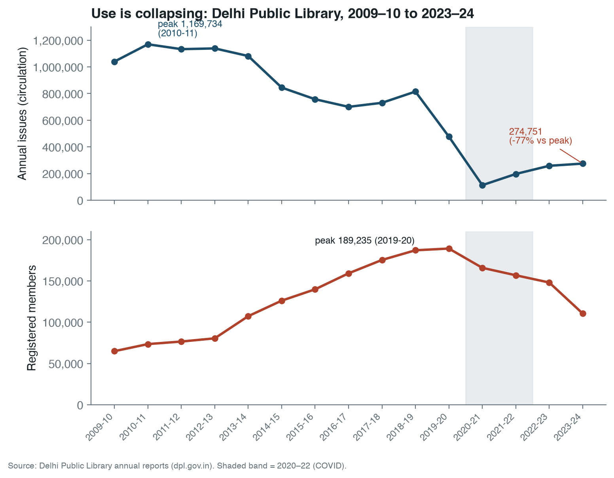
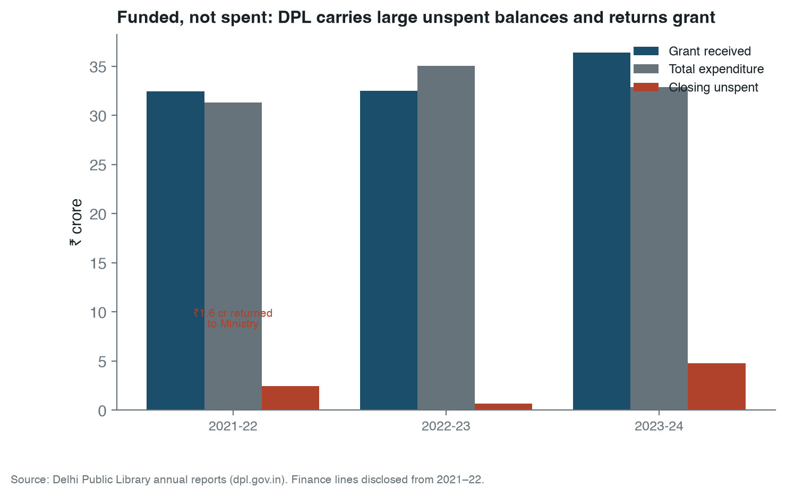
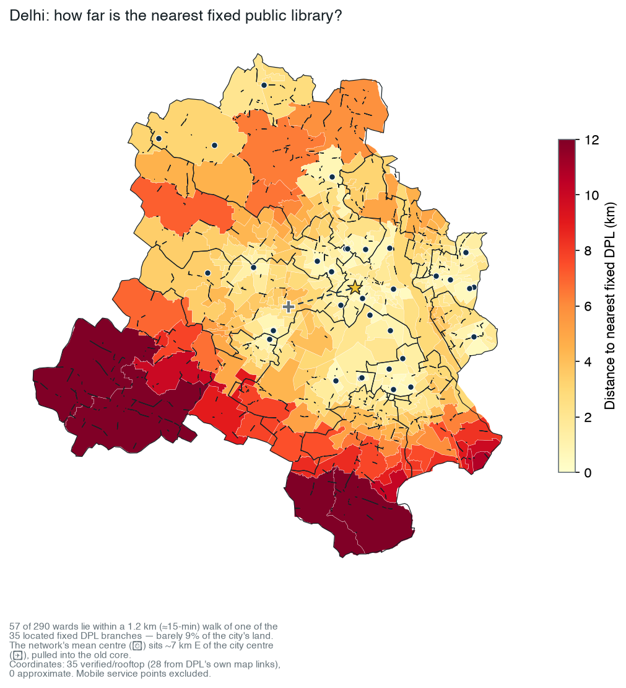
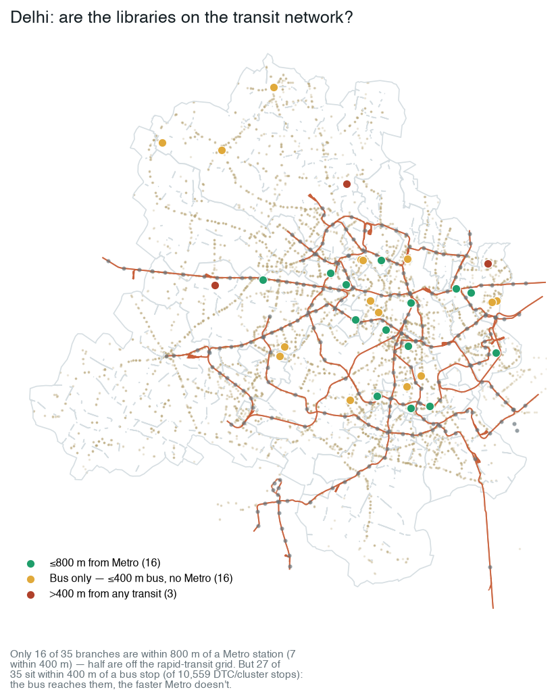

## Abstract

A public library is only public if people can reach it and use it. This paper asks
whether the Delhi Public Library (DPL) — founded in 1951 as a Government of India /
UNESCO pilot public library, and still run as a central, Ministry-of-Culture
autonomous body — meets that standard, against three tests a city library should
pass: is it dense and reachable enough; do people use it; and is it funded, and does
it spend, to deliver the service. We answer with DPL's own annual reports across
fifteen years.

The findings are stark. Public use has not merely stagnated, it has collapsed:
annual book issues fell about 77 percent, from a peak of 1,169,734 in 2010-11 to
274,751 in 2023-24, and the inflow of new stock all but stopped — books added to the
collection fell from roughly 78,000 a year to about 3,100. Membership grew through
the 2010s to a 2019-20 peak of 189,235 and has since fallen to 110,534. The fiscal
picture is the opposite of starvation and just as damaging: DPL is generously funded
by its central grant but does not spend it. In 2023-24 it carried Rs 4.78 crore
unspent against a Rs 36.4 crore grant; in 2021-22 it returned Rs 1.58 crore to the
Ministry. In purchasing-power terms its library-materials spend per resident is a
tiny fraction of a functioning system's. Where Ahmedabad's municipal network spends
on establishment rather than books, Delhi's central library does not spend at all. And
the network barely reaches: mapping its located fixed branches, only about 15 percent
of Delhi's wards lie within a 15-minute walk of one, and half the branches sit off the
Metro grid that could carry people to them.

## The case: why a city library must be reachable

Before measuring Delhi, we should say plainly what a public library is for, and why
its reach matters. Three claims set the standard the rest of the paper tests.

**A public library is civic infrastructure, not a book warehouse.** Its purpose is
use. Ranganathan's laws are blunt about it: books are for use, every reader should
find their book and every book its reader, and the reader's time should be saved
[@ranganathan1931]; the IFLA-UNESCO manifesto frames the public library as a local
institution for education, information, and democratic life [@iflaManifesto2022] —
the very mandate under which DPL itself was created as a UNESCO pilot in 1951.
Contemporary scholarship reads the library as social and intellectual infrastructure,
a low-threshold public place to be provisioned and judged like other urban systems
[@mattern2014; @klinenberg2018]. In India the institution has been named a bedrock of
democratic and anti-caste life [@liangGupta2024] and just as routinely left to decay
by the governments that own it [@chitralekha2014; @pyati2009]. For a campaign for the
right to read, the library is the public's standing claim on knowledge; whether
people can reach and use it is the whole question.

**A library is public only if it is reachable.** Most users of an Indian city library
do not arrive by car; they walk or take a bus, and the residents who depend most on a
nearby branch — children, students, women, older and poorer people — are exactly
those least able to travel far. Use falls with distance: the spatial-access
literature treats proximity, travel time, and distance decay as central, not
incidental [@penchansky1981; @luoWang2003]. Cities now plan deliberately for
short-walk access to everyday public facilities — the "15-minute city" and, since
2016, China's "15-minute community life circle," which set pedestrian-distance
coverage of daily public facilities, libraries among them, as a measured governance
target [@yangQian2024; @maEtal2023]. Where walking ends, buses and the metro must
extend the reach, and the IFLA service guidelines are explicit that service points
belong where people already converge, tiered outward so everyone is reached
[@iflaServiceGuidelines2010]; a nearby stop is not yet access, since the first- and
last-mile is where journeys break down, especially for women [@roy2024].

This is not a parochial or a Northern standard. Reachable, well-served neighbourhoods
are what the major quantitative livability frameworks measure and reward — the
Economist Intelligence Unit's liveability ranking, the Mercer quality-of-living
index, the Social Progress Index, and the wider field of more than 150
city-benchmarking efforts [@wolfmayr2024; @kitchin2015] — and the cities that
consistently top them (Vienna, Vancouver, Melbourne, Geneva) are those with dense,
walkable, transit-served public provision. The same coverage logic is now codified
across the Global South, most explicitly in China's life circle [@yangQian2024;
@maEtal2023], and runs through Southern urban practice more broadly, where reliable
access to shared services is the test of a functioning city [@bhan2019;
@routledgeGlobalSouth2017]. We borrow the coverage logic, not the league tables:
rankings can be naive and politically loaded, treating the city as a scoreboard
rather than a public [@kitchin2015]. Indian researchers have documented the same
deficits at home — transport policy that omits equity [@verma2021], streets captured
by the private automobile [@gopakumar2020], shrinking and unequal public open space
[@nagendra2023], and a long contest over India's "open space" and "public place"
[@chakrabarty1991]. The public library is one more public amenity inside this pattern.

Together these set the tests for Delhi: is the system dense and reachable enough; do
people use it; and is it funded — and spent — to deliver. The measurement that follows
serves those questions, not the reverse.

## Measurement frame

We use the IFLA Library Map of the World grammar, built on ISO 2789 definitions:
service points, registered users, visits, loans, staff, internet access, and
collections, all comparable per population [@iflaLibraryMapData; @iso2789]. ISO 11620
adds the performance question — not how much a library owns, but how well its
resources convert into use [@iso11620]. A branch count alone can make a weak system
look healthy; "access," likewise, can be merely nominal [@mickiewicz2016]. Access is
not distance: a defensible accessibility model needs demand origins, supply capacity,
travel time, catchments, and distance decay, not nearest-facility distance alone
[@guagliardo2004; @luoWang2003; @luoQi2009; @nisar2018]. Five rules carry into the
analysis: normalize by population; separate service points from effective capacity;
treat public funding as an input, not a result; read user fees as a possible barrier
even when fiscally minor; and keep spatial access as a proxy until travel-time routing
is built.

## Data and methods

The unit of analysis is the Delhi Public Library system, a central
Ministry-of-Culture autonomous body, not a municipal network. We read it against a
single external benchmark — the Toronto Public Library — used only as a yardstick for
what a functioning municipal system discloses and reaches.

For Delhi we use DPL's own annual reports, 2009-10 to 2023-24, for membership, issues
(circulation), reading-room attendance, collection, additions, and — from 2021-22,
when the lines are disclosed — finance [@dplAnnualReports]. We normalize by the
National Capital Territory population, taken as 19.0 million (2020 projection; the
2011 Census figure of 16.79 million is retained only for audit), and report a National
Capital Region shadow catchment (27-32 million) as a sensitivity, not the primary
denominator, because DPL's service jurisdiction is the NCT. For Toronto we use the
city's open data and 2024 published facts against a 2.79 million-resident base.
Finance is compared in purchasing-power-parity international dollars where both sides
disclose it. All figures are produced from these source tables by
`scripts/make_delhi_library_paper_figures.py`; the full source inventory is in the
appendix.

The spatial layers are now built, with their limits stated up front. Of DPL's 111
published locations, 35 are fixed service points (fixed, zonal, sub-branch, and
community libraries); 22 of these are now located — 5 on DPL-published/verified
coordinates and 17 by approximate address geocoding — and 13 could not be resolved.
Delhi's Metro network is joined from OpenStreetMap (246 stations, the line geometry),
and ward boundaries are the pre-2022 set (the 2022 unified-MCD 250-ward delimitation
is not openly available as geometry). This is enough to compute ward walk-access and
transit-siting for the fixed network, which we do below; the maps should be read as
indicative of sparsity, not as a survey, and mobile service points are excluded
because they are not fixed access. Bus (DTC/cluster) layers and the 13 unresolved
locations remain the next step.

## Delhi I — who uses it, and the decade of collapse

DPL's own reports show public use collapsing across fifteen years (Figure 1).

{#fig-decline width=100%}

The underlying values:

| Year | Issues (circulation) | Members | Books added | Collection |
|---|---:|---:|---:|---:|
| 2009-10 | 1,039,977 | 64,883 | 77,872 | 1,552,000 |
| 2010-11 | **1,169,734** | 73,467 | 33,868 | 1,608,813 |
| 2013-14 | 1,081,767 | 107,276 | 23,565 | 1,694,695 |
| 2016-17 | 700,412 | 159,200 | 38,256 | 1,706,326 |
| 2018-19 | 814,858 | 187,138 | 27,958 | 1,694,950 |
| 2019-20 | 477,008 | **189,235** | 13,310 | 1,596,125 |
| 2020-21 | 112,946 | 165,854 | 2,504 | 1,602,290 |
| 2022-23 | 258,180 | 148,094 | 9,947 | 1,536,905 |
| 2023-24 | 274,751 | 110,534 | 3,108 | 1,527,531 |

Three movements run through the record. First, circulation collapsed: issues peaked
at 1,169,734 in 2010-11, were already sliding through the mid-2010s, and stand at
274,751 in 2023-24 — a fall of about 77 percent, with the post-2019 crash never
recovering. At 19 million residents that is roughly 0.014 issues per resident a year.
Second, the collection stopped being renewed: books added fell from 77,872 in 2009-10
to about 3,100 in 2023-24, and the total collection has shrunk slightly since 2018-19.
A library that adds almost no new books gives the public little reason to return.
Third, membership tells a softer but consistent story: it grew through the 2010s to
189,235 in 2019-20, then fell by more than 40 percent to 110,534 — about 0.58 percent
of NCT residents. Growing the roll while circulation fell means the members it had
were already using it less; shedding the roll since means it is losing even nominal
reach.

## Delhi II — funded, but not spent

Delhi's fiscal pathology is the mirror image of underfunding. DPL is a centrally
funded institution that does not spend what it is given (Figure 2).

{#fig-finance width=100%}

In 2023-24 DPL received a grant of about Rs 36.4 crore, spent about Rs 32.9 crore, and
carried Rs 4.78 crore — roughly an eighth of the grant — unspent into the next year.
In 2021-22 it returned Rs 1.58 crore of public money to the Ministry as unspent. This
is not a system rationing scarce funds; it is a system that cannot, or does not,
convert its budget into service. The materials line makes the point sharply: in
purchasing-power-parity terms, DPL's library-materials spend per resident is on the
order of a thousandth of Toronto's — consistent with adding three thousand books a
year to serve a city of nineteen million. Money is reaching the institution. It is not
reaching the shelves, and it is not reaching the public.

## Delhi III — is it dense and reachable enough?

Start with density. On a conservative count DPL operates about 40 service points
(fixed libraries plus mobile buses) for 19 million residents — roughly 2.1 per
million, against Toronto's 34 per million, a sixteen-fold difference before any
travel-time disadvantage is measured. Even on the most inclusive count of DPL
touchpoints (about 163, including mobile service points and book-reading centres) the
system is thin relative to the population it nominally serves.

Density understates the problem, because the few fixed branches are not spread to
where people live. Mapping the 22 located fixed branches against Delhi's wards
(Figure 3), only **42 of 290 wards — about 15 percent — fall within a 1.2 km
(roughly 15-minute) walk of a fixed DPL branch**, and the median ward sits **2.66 km**
from its nearest one. The branches cluster in the old core (New Delhi, West, Central,
North districts hold most of them) while whole peripheral districts have one located
fixed branch or none. For most of Delhi, the nearest public library is not walkable.

{#fig-walk width=100%}

Nor does transit rescue the reach. Joining the branches to Delhi's Metro — one of the
densest rapid-transit networks in the country — only **11 of the 22 fixed branches sit
within 800 m of a Metro station, and just 3 within 400 m** (Figure 4). Half the fixed
network is off the rapid-transit grid that already carries the students, women, and
low-income riders a public library is meant to serve. Siting service on the corridors
where Delhi already moves is the most direct way to extend reach without building a
single new branch.

{#fig-transit width=100%}

The maps are indicative, not survey-grade: 17 of the 22 coordinates are approximate,
13 fixed locations could not be geocoded, and the ward layer is the pre-2022 set. But
the pattern is robust to that noise — a sparse network, concentrated in the core, only
loosely tied to the transit that could carry people to it.

## Toronto, briefly: a background yardstick

Toronto is not the subject of this paper; it is a reference for what a functioning
municipal library discloses and reaches. On shared, population-normalized indicators:

| Indicator | Delhi (DPL) | Toronto | Toronto/Delhi | Comparability |
|---|---:|---:|---:|---|
| Service points per million residents | 2.1 | 34.0 | 16.2x | Medium |
| Collection items per 1,000 residents | 80.4 | 3,500 | 43.5x | Medium |
| Registered members, share of residents | 0.58% | not normalized |  | Partial |
| Issues / borrowings per resident | 0.014 | 10.0 | ~690x | Medium |
| Reading-room / branch visits per resident | 0.018 | 4.8 | ~250x | Partial |
| Library-materials spend per resident (PPP) | very low | high | ~1,480x | Medium |

Toronto is denser, deeper, and far more used. The borrowing gap is roughly 690 times
per resident — and, as with Ahmedabad, it dwarfs any plausible spending gap, because
Delhi's problem is not a shortage of grant but a failure to spend it. The
reading-room and visit rows are kept as partial: DPL reports reading-room attendance,
not all branch visits, so its visit figure is understated. One row is reported without
a clean ratio because DPL's registered-member stock and Toronto's new-card
registrations are different objects.

## What Delhi should do

First, treat DPL as a public-use system, not a custodial collection. The metrics that
matter — issues, active members, books added — are all disclosed and all falling; a
credible target is stated against them, not against the existence of branches.

Second, spend the grant on the service. A library that returns money to the Ministry
and adds three thousand books a year is failing a budget problem in reverse: the fix
is procurement, hours, staffing, and new stock, not more allocation. The unspent
balance is, in effect, a measure of the service not delivered.

Third, build for reach. DPL is sparse — about two service points per million against a
functioning system's thirty-plus — and the mapped branches reach only about 15 percent
of wards within a walk and sit half off the Metro. The immediate, low-cost step is to
place new service on Delhi's Metro and bus corridors, which already carry the residents
DPL is meant to serve, rather than leaving the network bunched in the old core.

Fourth, name the governance. DPL is a central Government-of-India body sitting inside
Delhi's fragmented NCT/MCD/NDMC arrangement; accountability for its decline is diffuse
by design. Saying who is responsible for use, renewal, and spending is the
precondition for fixing any of it.

## Data gaps and next work

DPL disclosure still lacks several IFLA-style fields: physical visits (as distinct
from reading-room attendance), e-book and digital use, full-time staff, internet
access points, and branch-level hours and capacity. The two highest-value extensions
are: completing the spatial picture — geocoding the 13 unresolved fixed locations and
the mobile service points, replacing the 17 approximate coordinates with verified
ones, and adding the DTC/cluster-bus layer to the Metro already joined; and extending
the disclosed finance series back before 2021-22 to date the onset of under-spending.

## Conclusion

The Delhi Public Library fails the tests a city library should pass. It is sparse —
about two service points per million residents — and what little exists is bunched in
the old core: only about 15 percent of wards are within a short walk of a fixed
branch, and half the network sits off the Metro. Its public use has collapsed: issues
down about 77 percent over a decade, new
stock down to a trickle, membership falling since 2019-20. And its money does not
move: a central grant carried unspent and returned to the Ministry while the shelves
go unrenewed. Toronto, used only as a yardstick, borrows on the order of 690 times
more per resident — a gap that has nothing to do with Delhi lacking funds. The
practical target is not a grander central library but a reachable, well-stocked,
fully-spent public system, sited where Delhi's residents already are and measured
every year on the use it actually delivers.

## Sources and reproducibility

**Delhi.** Membership, issues, reading-room attendance, collection, additions, and
finance are from the Delhi Public Library's annual reports, 2009-10 to 2023-24
[@dplAnnualReports]. Location counts are from DPL's published zone listings; NCT and
NCR population denominators are from Census 2011 and MoHFW Technical Group projections.

**Toronto (background yardstick).** Branch, collection, borrowing, visit, and
registration figures are from Toronto Open Data and Toronto Public Library's 2024
published facts [@torontoOpenDataBranchInfo; @tplAbout2026]; finance from the 2026
budget [@tplFinance2026].

**Standards.** Indicators follow the IFLA Library Map of the World grammar and ISO
2789 / ISO 11620 definitions [@iflaLibraryMapData; @iso2789; @iso11620]; the normative
and siting frame draws on the IFLA-UNESCO Public Library Manifesto (2022) and Service
Guidelines (2010) [@iflaManifesto2022; @iflaServiceGuidelines2010].

The IFLA frame is used as an indicator grammar, not a claim that every field has a
single universal target: matched indicators are separated from partial ones, and where
a system does not disclose a metric the absence is kept as a data gap rather than
inferred. Finance is compared in PPP international dollars (World Bank conversion). All
charts are reproducible from the source tables by the figure script in the project
repository.
