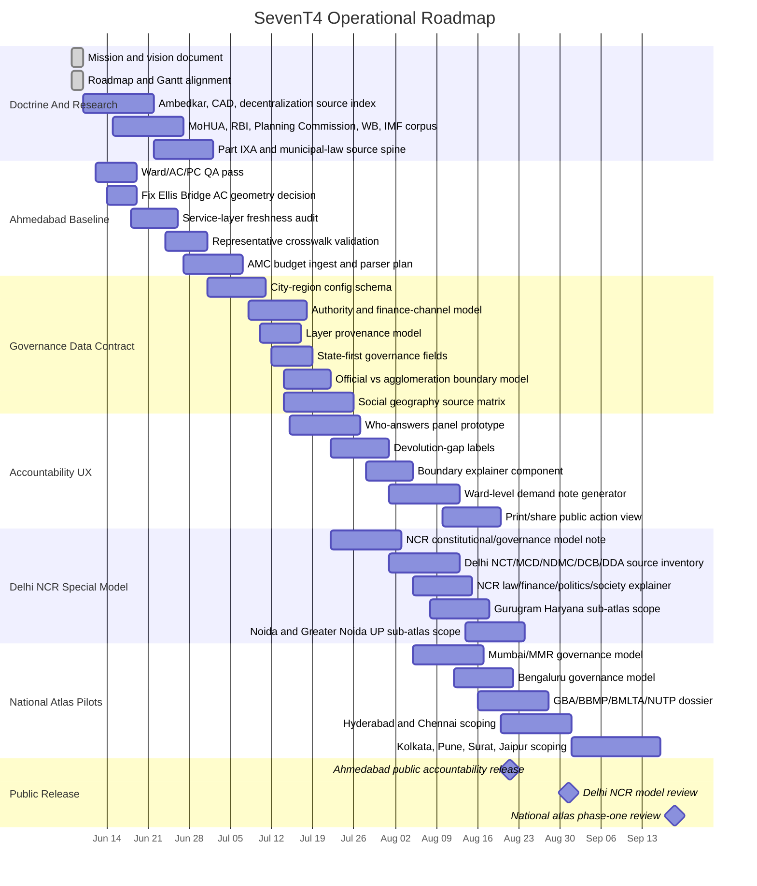

# SevenT4 Gantt Plan

_Status: working schedule. Last updated: 2026-06-08._

This Gantt chart is tied to [the roadmap](roadmap.md). It begins with the
current research and documentation pass, then moves into Ahmedabad hardening,
the reusable governance contract, Delhi NCR special modeling, and national
atlas pilots.

## Roadmap Mapping

- `DOC-001`, `DOC-002`: mission, roadmap, and Gantt documents.
- `REF-001`: Ambedkar, CAD, decentralization, federalism, and local-state
  source spine.
- `REF-002`: MoHUA, RBI, Planning Commission, NITI Aayog, Finance Commission,
  World Bank, and IMF policy-finance corpus.
- `REF-003`: Part IXA and municipal-law source spine.
- `BUG-AHD-001`, `QA-AHD-001`: Ahmedabad geometry and crosswalk reliability.
- `DATA-AHD-001`, `DATA-AHD-002`, `BUD-AHD-001`: Ahmedabad provenance,
  representative, service, and finance layers.
- `CITY-001` to `CITY-003`: reusable city-region contract.
- `CITY-004`: state-first urban governance fields for state municipal law,
  state urban departments, and devolution orders.
- `CITY-005`: official data boundary, urban agglomeration boundary, and
  source-warning model.
- `FEAT-ACC-001`, `FEAT-ACC-002`, `FEAT-ACT-001`, `FEAT-ACT-002`:
  accountability and public-action surfaces.
- `CITY-NCR-001` to `CITY-NCR-004`: special Delhi NCR model, including Delhi
  NCT, Union-controlled institutions, municipal bodies, Gurugram, Noida, and
  Greater Noida.
- `CITY-NCR-005`: NCR law, finance, politics, culture, economy, and society
  explainer.
- `FEAT-EXP-001`: public website explainer for official limits vs lived
  agglomeration.
- `CITY-MMR-001`, `CITY-BLR-001`, `CITY-SOUTH-001`, `CITY-REST-001`: national
  atlas expansion.
- `CITY-BLR-002`, `CITY-BLR-003`: Greater Bengaluru governance and transport
  authority dossier, including GBA, BBMP transition, BMLTA, NUTP 2006, and UMTA.
